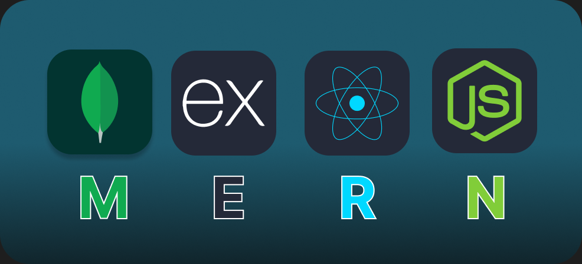

<h1 align="center">Hi 👋, I'm Aman</h1>
<h3 align="center">MERN Stack Developer | Full Stack Web Enthusiast</h3>

  

---

## 🚀 About Me

- 💻 I’m a **MERN Stack Developer**
- 🌱 Currently learning **Advanced React & Backend Optimization**
- 🔥 Love building **full-stack web applications**
- 📫 Reach me at: **amangound726482@gmail.com**
- ⚡ Fun fact: *I turn coffee ☕ into code*

---

## 🛠️ Tech Stack

### Frontend

  
  
  
  

### Backend

  
  

### Database

  
  

### Tools

  
  
  

---

## 🤝 Connect With Me

  
 

---

⭐ **If you like my work, consider starring my repositories!**

